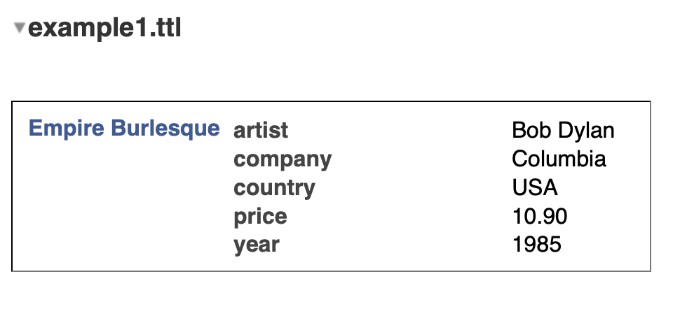

Encouraging widespread use of the solid platform has some challenges.  These range from perceived difficulty of using data in rdf to represent data, to inexperience with the solid server itself.  This article is not a backgrounder on rdf or solid; rather I want to deal with the challenge of using rdf and the re-use of data.

While solid's persistence paradigm is document oriented rather than store or 'database' oriented.  Using the document is not as easy as 'file open' and 'file save' semantics.

## 1. Why is rdf difficult to use?

RDF was originally an XML based format making it very hard for humans to read.  See the example below:

```
<?xml version="1.0"?>

<rdf:RDF xmlns:rdf="http://www.w3.org/1999/02/22-rdf-syntax-ns#" xmlns:cd="http://www.recshop.fake/cd#">

<rdf:Description rdf:about="http://www.recshop.fake/cd/Empire-Burlesque">
  <cd:artist>Bob Dylan</cd:artist>
  <cd:country>USA</cd:country>
  <cd:company>Columbia</cd:company>
  <cd:price>10.90</cd:price>
  <cd:year>1985</cd:year>
</rdf:Description>

</rdf:RDF>

</xml>
```

Nowadays there are formats like turtle and json-ld that are easy to write and read.  Json-ld is just json, while turtle is as easy to read (for me) as yaml.  Below is the translation of the rdf-xml into turtle format:

```
@prefix cd: <http://www.recshop.fake/cd#> .

<http://www.recshop.fake/cd/Empire-Burlesque> 
    cd:artist "Bob Dylan";
    cd:price "10.90";
    cd:country "USA";
    cd:company "Columbia";
    cd:year "1985".
```

Other than the `@prefix` there is not a lot of difference between this and a yaml file.  However there are few use cases where you would want to craft data by hand.  In the next section we look at some of the ways to interact with turtle as data.

## 2. Some usage considerations.

There are many libraries for reading rdf documents.  I won't go into any details about these.  Most of the javascript clients and servers are based on `rdfjs`.  The solid 'browser' is based on rdflibjs, one of the most well used libraries.

 

The screenshot above, shows the data presented in the solid 'browser'.  There are a number of observations I want to make about the screenshot, not to be critical, but to tease out some of the design issues we need to confront.

### 2.1 IRIs are ugly

The purpose of the `@prefix` is to make the balance of the turtle file easier to read.  However, when the data is in memory (or in a triple-store), the 1st triple would be:

```
<http://www.recshop.fake/cd/Empire-Burlesque> <http://www.recshop.fake/cd#artist> "Bob Dylan" .
```

The challenge in any user interface is to get this raw form onto the screen in as meaningful way as possible.  As you can see from the screenshot, only the last part of the subject, predicate, object are used: Empire-Burlesque, artist, "Bob Dylan".  In addition, the hyphen in Empire-Burlesque is removed to make it read "Empire Burlesque".

As in most software projects there is a trade-off between the specific and the general. The solid 'browser' has chosen to be general and adopt this kind of alogrithm to support the almost infinite range of data that it needs to represent.  If you needed other languages or more complex forms you would need something else here.

### 2.2 Control over order

Notice that in the turtle snippet above 'price' comes before 'country', yet in the screenshot the predicates are listed in alphabetical order.  Another clear design choice.  There are a couple of issues here.  First, if the document were just that, the order chosen by the author should be respected.  Second, if the document is just a means of persisting the data until it is in memory. Absent of other information, alphabetical is about the only way to go.  

So the question is, how do we inform general purpose clients of the true intent of the author?

## 3. Data re-use

Usually, there is a close-coupling between an application and the data format chosen by the application authors.  The authors of the application choose the format (and persistance mechanism) for the data and either allow others to interact with the format by publishing it or regards it as their 'secret sauce' and do everything they can to prevent other applications from using it.

Rdf, on the other hand, is a totally open machine and human readable format.  So it represents a fantastic opportunity for data re-use in different applications.  But just having data in a human and machine readable format is not enough.

Standard vocabularies like friend of a friend (foaf), dublin core(dc), owl, rdf, rdfs, and so on, go some way to encouraging re-use because they provide a meaning system to tagged data.  Consider this bookmark produced by the Markbooks app:

```
@prefix terms: <http://purl.org/dc/terms/>.
@prefix bookm: <http://www.w3.org/2002/01/bookmark#>.
@prefix n0: <http://xmlns.com/foaf/0.1/>.
@prefix c: </profile/card#>.
@prefix you: <https://youtu.be/>.

<> terms:references <#0.056127920957769306> .
        
<#0.056127920957769306>
    a bookm:Bookmark;
    terms:created "2019-02-14T06:14:55.926Z"^^XML:dateTime;
    terms:title "Open Artificial Pancreas";
    bookm:recalls you:p76hGxv3-HE;
    n0:maker c:me.
```

By making reference to the standard vocabularies listed in `@prefix`, I can get the definition of each of the terms a take a look at other related items from the chosen vocabulary.  Let's now take a look at some of the re-use use cases.

### 3.1 Same data, new UI

In this case we want to use the data as prepared but in a new UI setting.  Say to display the last 10 bookmarks in a moving ticker at the bottom of a home page. Armed with the turtle file and the vocabulary, it is relatively straightforward to use the data in a different UI.

### 3.2 A new editor

Editing the data is a small step-up from just viewing the data differently.  However, if we wanted to be able to add new bookmarks, we would need to be able to mimic the identification of bookmarks within the document or keep to a different document.  The fragments seem to be from a random number generator, but Markbooks haven't gone out of their way to explain this and it isn't in the vocabulary.  There are risk of clashes for people who user both applications.

### 3.3 Extending the functionality

How might one craft an application that builds on the data and functionality?  For example by adding topic tags.

If we are careful, rdf extends quite easily. If we added the following, we would be able add a topic, which is part of the `bookm:` vocabulary.

```
<#OpenSource> a bookm:Topic;
    terms:title "My Open Source Collection";
    bookm:leadsTo <#0.056127920957769306> .

<#0.056127920957769306> bookm:hasTopic <#OpenSource> .
```

We would also need to decide whether to add this information in the original document or some other document and ensure that both are loaded at the same time.

A key question is how do apps communicate the data they are expecting or creating?

# 4. Moving towards a solution

So far we have highlighted a number of design issues that need careful consideration in order to reduce the friction and reluctance by developers to get involved with rdf data.  These can be summarized as:

- How general purpose is my application?  Is it trying to edit all rdf data sets or data from a particular domain?  If its general purpose how do we annotate the rdf to make the ui more human friendly?
- How do we bridge the divide between document orientation (where the order of the information should be as given) and the store orientation (where the order is based on internals)?
- How do applications signal the data they expect or are creating?

I believe that we need to adopt some standard way of addressing this as a community.  We cannot afford to introduce a 'tower of babel' for data about our data in addition to all the other data differences. 

I will set out some of my own ideas in the coming weeks, but for now I just want to get some discussion going on the topic.

[Next](../using-rdf-data-2)
